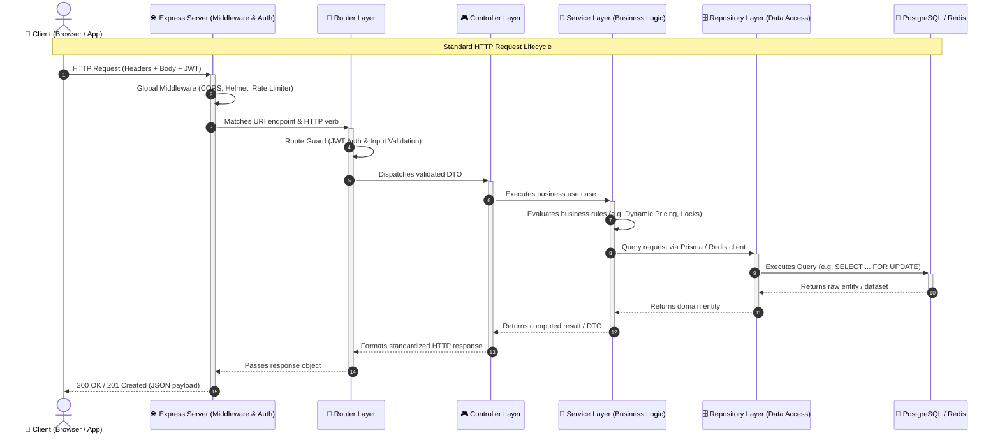
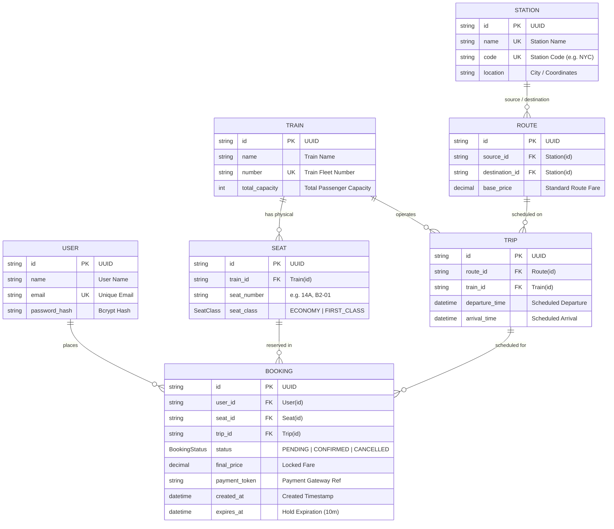
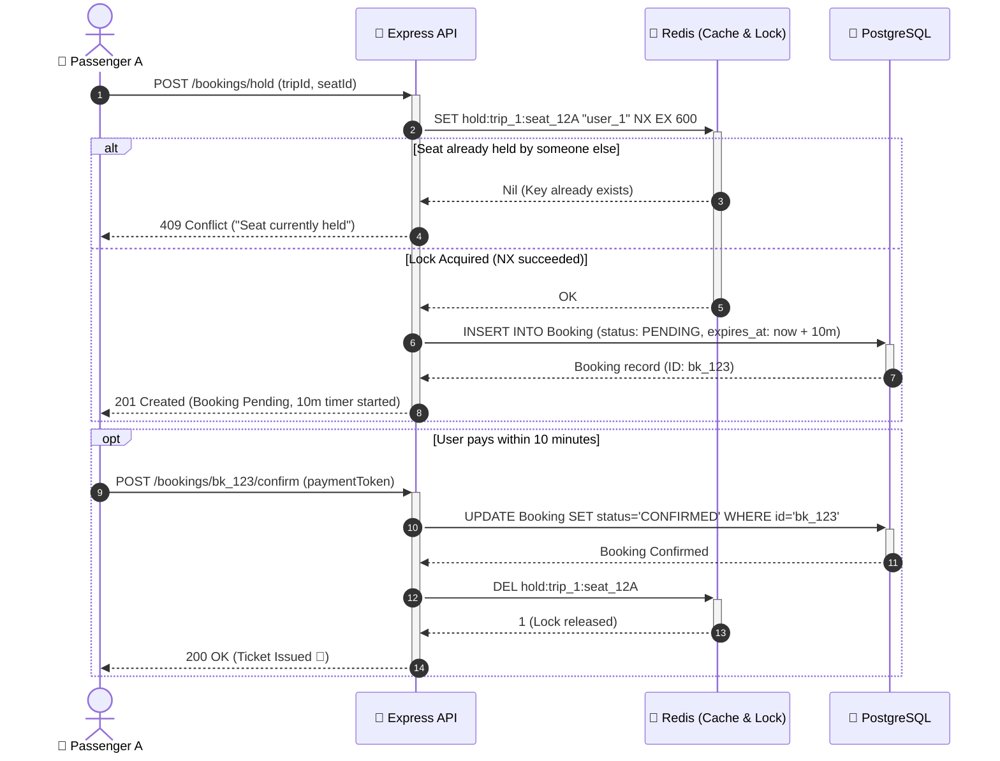
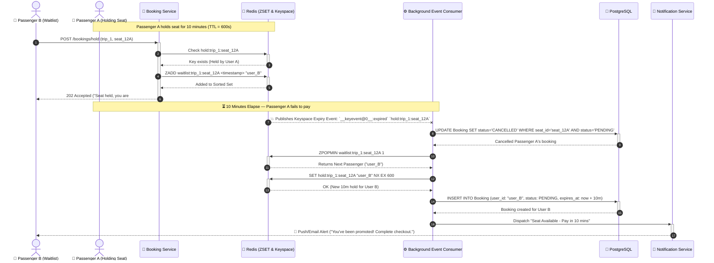

# 🚆 Railway Ticket Reservation System

A high-concurrency backend system for booking railway tickets, built to explore distributed locking, graph algorithms, dynamic pricing, and event-driven architecture — designed and built phase by phase with production practices (CI/CD, load testing, clean layered architecture) from day one.

---

## 🛠️ Tech Stack


---

## 🏗️ Layered Architecture & Request Lifecycle

This project follows a strict layered architecture per module to enforce separation of concerns, testability, and maintainability:

$$\text{Client} \longrightarrow \text{Server (Express)} \longrightarrow \text{Route} \longrightarrow \text{Controller} \longrightarrow \text{Service} \longrightarrow \text{Repository} \longrightarrow \text{PostgreSQL / Redis}$$

### Request Flow Diagram



- **Route** — Maps HTTP endpoints, applies validation schemas and JWT authentication guards.
- **Controller** — Handles request extraction, calls services, and maps results to HTTP status codes (no business logic).
- **Service** — Encapsulates core business rules, algorithms, dynamic pricing strategies, and concurrency locks (fully unit-testable in isolation).
- **Repository** — The only layer that interfaces directly with the database (Prisma / Raw SQL / Redis).

---

## 📊 Database Design & Entity Relationships

The schema is built with **PostgreSQL** and managed via **Prisma ORM**.



---

## 🧩 Deep-Dive Workflows & Core Algorithms

### 1. Graph-Based Multi-Hop Route Search (Dijkstra + Min-Heap)

Railway networks are modeled as a **weighted directed graph** $G = (V, E)$, where Stations are vertices ($V$) and direct Routes are edges ($E$) with weight equal to `base_price`. A generic **Min-Heap** provides $O(\log V)$ priority queue operations to find the cheapest path between any two stations, even if no direct train exists.

```mermaid
flowchart TD
    classDef startNode fill:#4F46E5,stroke:#312E81,stroke-width:2px,color:#fff;
    classDef intermediateNode fill:#0284C7,stroke:#0369A1,stroke-width:2px,color:#fff;
    classDef targetNode fill:#059669,stroke:#047857,stroke-width:2px,color:#fff;
    classDef heapNode fill:#F59E0B,stroke:#B45309,stroke-width:2px,color:#fff;
    classDef pathEdge stroke:#10B981,stroke-width:3px,color:#10B981;

    subgraph Station_Network ["🚉 Railway Graph Representation"]
        S1(["Station A (Start)"]):::startNode
        S2(["Station B"]):::intermediateNode
        S3(["Station C"]):::intermediateNode
        S4(["Station D (Dest)"]):::targetNode

        S1 -- "$50" --> S2
        S1 -- "$120 (Direct)" --> S4
        S2 -- "$30" --> S3
        S3 -- "$25" --> S4
        S2 -- "$60" --> S4
    end

    subgraph Min_Heap_Process ["⚡ Min-Heap Execution Step-by-Step"]
        H1["1. Push (A, $0) to Min-Heap"]:::heapNode --> H2["2. Pop A -> Relax Neighbors (B: $50, D: $120)"]:::heapNode
        H2 --> H3["3. Pop B ($50) -> Relax (C: $50+$30=$80, D: $50+$60=$110)"]:::heapNode
        H3 --> H4["4. Pop C ($80) -> Relax (D: $80+$25=$105) [Cheapest!]"]:::heapNode
        H4 --> H5["5. Pop D ($105) -> Target reached, backtrack path"]:::targetNode
    end

    subgraph Optimal_Result ["✅ Cheapest Route Found"]
        R["A ➔ B ➔ C ➔ D = $105 (Saves $15 vs Direct $120)"]:::targetNode
    end

    S1 ==>|Step 1| S2 ==>|Step 2| S3 ==>|Step 3| S4
```



---

### 2. 10-Minute Redis Seat Hold & TTL Workflow

To provide a smooth checkout experience without blocking database connections, a seat is placed on a **10-minute temporary hold** in Redis using atomic key allocation.



---

### 3. Seat Waitlist & Event-Driven Auto-Promotion Flow

When a seat is already held, subsequent users can join a **FIFO Waitlist** backed by a **Redis Sorted Set (`ZSET`)**. If the 10-minute hold expires without payment, a **Redis Keyspace Notification** triggers an event that automatically promotes the next passenger in line.



---

## ✨ Features Implemented So Far

- ✅ **Authentication** — JWT-based register/login with bcrypt password hashing
- ✅ **Concurrency-Safe Booking** — Row-level locking (`SELECT ... FOR UPDATE`) inside a Postgres transaction to eliminate double-booking under high load
  - Proven with a **k6 load test** firing 50 concurrent requests at a single seat — exactly one booking succeeds, the rest correctly receive `409 Conflict`
  - Unit-tested with Vitest (repository mocked, service logic isolated)
- ✅ **Graph-Based Multi-Hop Route Search** — Models stations and routes as a weighted directed graph and runs **Dijkstra's algorithm** with a custom-built generic **Min-Heap** ($O(\log V)$ insert/extract) to find the cheapest path, including multi-hop connections a direct-route query would miss
- ✅ **Redis Layer**
  - **TTL-based seat holds** — Unpaid bookings auto-expire and release the seat via Redis keyspace notifications (event-driven, not polling)
  - **Route search caching** — Fast retrieval of frequently searched station pairs
  - **Sorted-Set (`ZSET`) waitlist** — Automatic promotion of the next user in line when a held seat is cancelled or expires
- ✅ **Dynamic Pricing Engine** — Strategy-pattern-based surcharges (occupancy-based, urgency-based), computed atomically inside the booking transaction and locked onto the booking permanently (`final_price`)
- ✅ **Idempotent Payments** — `Idempotency-Key` header pattern (industry standard, same approach Stripe uses) prevents duplicate charges on network retries or repeated client requests
- ✅ **CI Pipeline** — GitHub Actions runs lint, build, and tests on every push

---

## ⚠️ Known Limitations (Honest, Deliberate Scope Choices)

- Multi-hop route search finds the cheapest path but does not yet validate that connecting trips have compatible arrival/departure timing.
- Route search estimated pricing uses simplified placeholder occupancy/timing; actual booking always computes and locks in the real, accurate price.
- Only single shortest-path is returned (not k-ranked alternatives).

---

## 🗺️ Roadmap

- 🔲 **Event-driven notifications** (Kafka / RabbitMQ integration for high-throughput message streaming)
- 🔲 **Observability** (Prometheus metrics exporter + Grafana dashboards)
- 🔲 **Full CI/CD deployment** (Automated Docker container builds and Kubernetes/Cloud deployment)

---

## 🚀 Getting Started

### Prerequisites
- Docker & Docker Compose
- Node.js (v18+) & npm

### Installation

```bash
# 1. Start PostgreSQL and Redis containers
docker compose up -d

# 2. Install project dependencies
npm install

# 3. Configure environment variables
cp .env.example .env

# 4. Run Prisma database migrations and seed initial data
npx prisma migrate dev
npx prisma db seed

# 5. Start the development server
npm run dev
```

---

## 🧪 Running Tests

```bash
# Run unit & integration tests with Vitest
npm test

# Run k6 high-concurrency booking load test
k6 run tests/load/concurrent-booking.js -e TOKEN=<jwt> -e SEAT_ID=<id> -e TRIP_ID=<id>
```

---

## 📌 Project Status
🚧 **In progress** — actively being built and documented phase by phase.  
*Currently on Phase 6 (Event-Driven Architecture & Message Brokers).*
